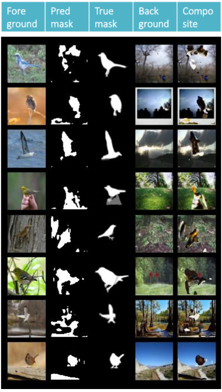

# object-discovery-cp-gan

This repository implements [1] in Python using the PyTorch framework, with some extra features that I found seem to improve the performance on realistic datasets. In this system, a generator neural network G is trained to produce copy masks, and a discriminator D then judges the quality of that object mask by trying to distinguish between real foreground images, and composite images where the segmented foreground has been pasted onto another background. A number of tricks (most notably anti-shortcut and grounded fakes) need to be employed to help convergence during training.

## Usage

Example commands:
```
python train_cpgan.py --dataset squares --gpus 0 1 --batch_size 64
python train_cpgan.py --dataset noisy --gpus 2 3 --batch_size 64
python train_cpgan.py --dataset birds --gpus 4 5 --batch_size 64 --img_dim 64 --blur_sigma 2 --autoencode
```
Both `squares` and `noisy` require CIFAR-10 under `data/CIFAR-10/train` and `data/CIFAR-10/test`, which can be downloaded in PNG format [here](https://pjreddie.com/projects/cifar-10-dataset-mirror/). The third example is a custom dataset, described below.

## Datasets

The nature of training requires that we curate a dataset consisting of two separate parts: (1) a collection of foreground or source images that each prominently contain one or multiple instances of the object that we wish to discover, and (2) a collection of background or destination images onto which the segmented objects will get pasted onto. It is important to note that the domain of (2) should visually resemble that of (1), otherwise training might not converge. Optionally, you could have (3) a collection of foreground masks that allows validation to calculate the Object Discovery Performance (ODP). The files should be organized as follows:
```
.
└── data
    ├── CIFAR-10   (needed for squares and noisy)
    |   ├── train
    |   |   ├── a.jpg
    |   |   └── b.jpg
    |   └── test
    |       ├── c.jpg
    |       └── d.jpg
    └── birds
        ├── train_fore
        |   ├── a.jpg
        |   └── b.jpg
        ├── train_mask   (optional)
        |   ├── a.jpg
        |   └── b.jpg
        ├── train_back
        |   ├── c.jpg
        |   └── d.jpg
        ├── val_fore
        |   ├── e.jpg
        |   └── f.jpg
        ├── val_mask   (optional)
        |   ├── e.jpg
        |   └── f.jpg
        └── val_back
            ├── g.jpg
            └── h.jpg
```
Here, `birds` can be any custom folder name as long as you supply it with the `--dataset` argument. Note that the masks must correspond to the images in the foreground folders, and must have the exact same file names.

## Features

*Baseline features:*

* Anti-shortcuts with irrelevant foregrounds to discourage copy-nothing and copy-all
* Border zeroing to prevent copy-all with a twist
* Discriminator input blurring to avoid low-level shortcuts
* Grounded fakes to stabilize training

*Extra features:*

* **Object autoencoding:** A direct generative method in RGB space was not pursued in [1] on the basis of their observation that discriminative methods are rising in popularity. We however believe that there is promise in trying to reconstruct the object in addition to just localizing its boundaries. More specifically, this change should prevent the generator G from copying irrelevant pixels, and also to specialize in just one kind of object, namely that which we are interested in by design of the dataset. During training, we insert a pixel-wise reconstruction loss that is weighted by the mask, and copy the highlighted objects from the autoencoded generator output rather than directly from the source image. Note that the operation at test time is identical to the original CP-GAN, in the sense that we can discard the RGB reconstruction and simply use the generated hard mask instead.

## Figures

The example below uses [Caltech-UCSD Birds-200-2011](http://www.vision.caltech.edu/visipedia/CUB-200-2011.html) as foreground images and [MIT Places2](http://places2.csail.mit.edu/index.html) with labels *forest*, *rainforest*, *sky*, and *swamp* as background images, all resized to 64x64.



## References 

[1] Arandjelović, R., & Zisserman, A. (2019). [Object Discovery with a Copy-Pasting GAN](http://arxiv.org/abs/1905.11369), 1–17.
